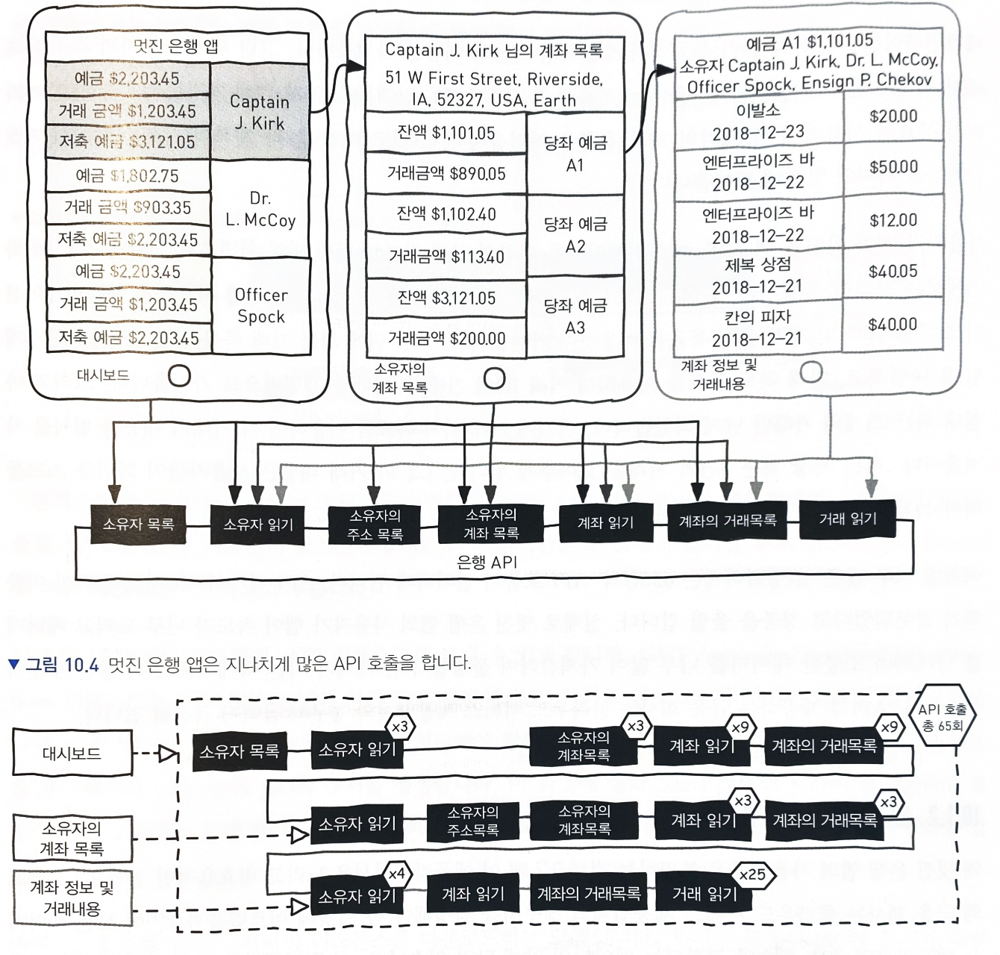
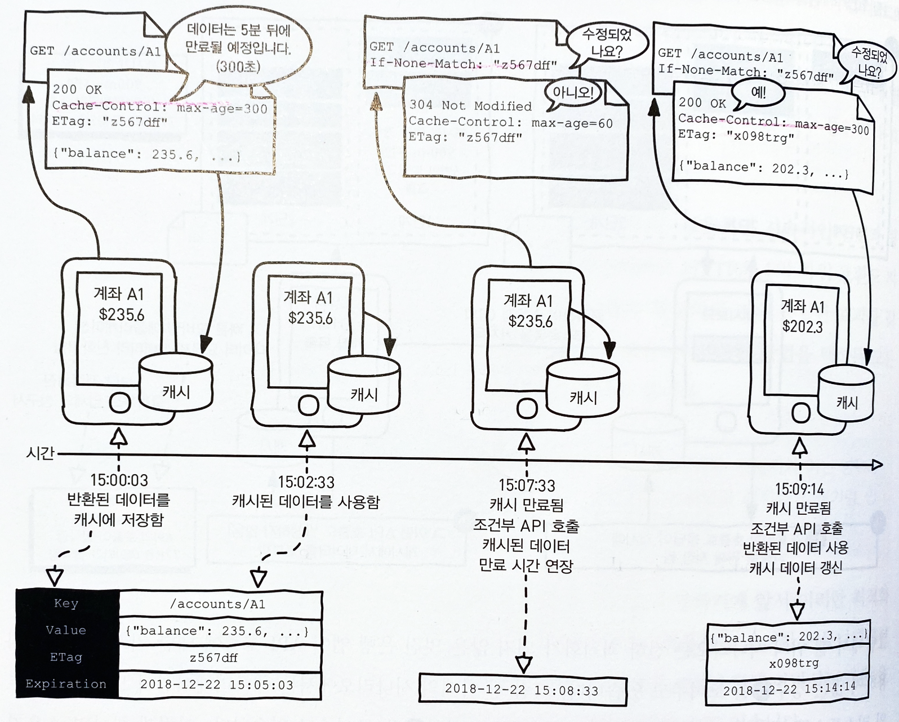

## 10. 네트워크 효율적인 API 디자인하기

*"API 디자인에 가장 중요한 컨텍스트는 네트워크이다."*


이 장의 내용

- 웹 API 네트워크 상호작용 관련 고려 사항
- 압축, 캐싱, 조건부 리퀘스트
- 더 적은 데이터를 더 적게 호출하도록 만드는 API 디자인 최적화


### 10.1 네트워크 커뮤니케이션의 고려사항의 개요

#### 10.1.1 장면 설정



65회라는 많은 양의 API 호출이 일어난다.

- 클라이언트 앱 속도가 느려짐
- 소비자들이 불평함
- 클라우드 청구서 금액이 올라감


#### 10.1.2 문제 분석하기

- 서버 접속
- 요청 처리
- 리퀘스트 처리

의 처리 시간 (지연시간)이 요청이 많아질수록 점점 길어짐 (병렬 처리를 하더라도 한계가 있다.)


- 속도
- 데이터 크기
- 호출 횟수

이 세 가지가 적을수록 네트워크 효율이 높다. 이 세가지를 명심하고 효율성과 일반적인 디자인 원칙 사이의 균형을 맞추자.


### 10.2 프로토콜 레벨에서 네트워크 커뮤니케이션 효율성 보장하기

- 압축(comporession)
- 지속적인 연결(Persistent connection)
- 캐싱(Caching)
- 조건부 리퀘스트(Conditional Request)


#### 10.2.1 압축(Compression)과 지속적인 연결(Persistent connections) 활성화하기

작은 리스폰스는 다운르도를 빠르게 만들 것이다. 또한 컨슈머들은 코드를 바꾸지 않고도 이 기능을 활용할 수 있다.

> ✏️ HTTP/2로 바꾸는 대안도 있다.


#### 10.2.2 캐싱(Caching)과 조건부 리퀘스트(Conditional request) 활성화 하기

*"커뮤니케이션을 하지 않거나 더 적게하는 방법"*


그림10.2 캐싱을 이용한 횟수 줄이기

위와 같이 호출 횟수를 줄일 수 있지만 얼마나 오랫동안 캐싱되어야할지 정보가 필요하다.




그림 10.3 HTTP 프로토콜의 캐싱 기능들 이용하기

헤더의 Cache-Control의 max-age로 캐싱 기간을 ETag로 캐싱 데이터가 변경되었는지를 판단할 수 있다.


> ❓캐싱 age에 대한 의문
>
> 하지만 캐시 시간 5분이라는 수치는 어디서 올까? 15분이나 2일이 아닌 이유는 뭘까? 캐시가 허용되는 이유는 뭘까? 


#### 10.2.3 캐시 정책 선택하기

올바른 캐시기간의 가장 중요한 요소는 데이터가 얼마나 수정되는지이다.


### 10.3 디자인 레벨에서 네트워크 커뮤니케이션 효율성 확보하기

*"프로토콜 수준이 아닌 디자인 수준에서도 효율성을 확보할 수 있다."*


#### 10.3.1 필터링(Filtering) 활성화 하기

*"필터링을 제공함으로서 정말 필요한 것들만 요청하게 되어 데이터 크기를 줄일 수 있다."*


예를들어 전체 거래 내역을 전달하던 API는 최신 3개월 내역을 전달함으로서 한 페이지당 10개의 데이터를 전달함으로서 데이터 크기를 현저하게 줄일 수 있다.


#### 10.3.2 목록 표현을 위한 연관된 데이터 선택하기

*"연관된 데이터를 한번에 전달하면 데이터 호출 수를 줄일 수 있다."*


예를들어 소유주 목록과 소유자 세부 정보 읽기 API가 다음과 같이 있다고 해보자.

**소유주 목록 API의 리스폰스**

```json
{
	"items": [
		{
			"id": "01",
			"firstName": "James",
			"lastName": "Kirk",
			"user": true
		}
	]
}
```

**소유주 세부 정보 API의 리스폰스**

```json
{
	"id": "01",
	"firstName": "James",
  "lastName": "Kirk",
	"title": "Captin", // 직급
  "birthDate": "2233-03-22"
}
```


이 경우 화면에 소유주 정보와 직급 정보를 모두 보여주려면 두 번의 호출이 필요하다. 이를 다음과 같이 소유주 목록 API에 요약 정보를 추가하면 한번의 호출로 동일 화면을 그릴 수 있다.

```json
{
	"items": [
		{
			"id": "01",
			"firstName": "James",
			"lastName": "Kirk",
			"user": true,
      "title": "Captin"
		}
	]
}
```


#### 10.3.3 데이터 집합체 만들기(Aggregating)

위와 같이 데이터를 하나로 뭉쳐서 여러번의 호출보다 하나의 긴 호출로 만들면 호출 횟수에 이점을 볼 수 있다. 하지만 지속적인 연결을 설정해뒀다면 이 전략은 그다지 효율적이지 않다. 

또한 특정 상황에선 집합체는 캐싱 가능성을 방해할 수 있다. 짧은 TTL의 데이터가 포함되어 있다면 다시 로드해야하기 때문이다. 

느린 네트워크에서는 짧게 여러번 호출하는 것보다 하나의 긴 호출이 연결 유실 위험성이 있다. 95%가 다운로드 된 상태에서 연결이 유실되면 처음부터 다시 받아야할 것이다.


#### 10.3.4 다른 표현 제안하기

생략 (비표준)


#### 10.3.5 확장 활성화하기

생략 (비표준)


#### 10.3.6 쿼리 활성화하기

GraphQL을 이용해 컨슈머가 원하는 데이터만 가져갈 수 있도록 쿼리 기능을 제공한다.

REST API의 쿼리 스트링을 사용해도 되지만 GraphQL은 여러번의 쿼리 대신 한번의 쿼리로 조회할 수 있다.

하지만 POST 메시드만을 사용하기 때문에 HTTP 표준 캐싱 방법으로는 캐싱할 수 없다.

> 🧑‍💻 데모 만들어보기


#### 10.3.7 보다 연관성 있는 데이터와 목표 제공하기

생략


#### 10.3.8 다른 API 레이어 생성하기

효율성도 좋지만 사용성과 재사용성까지 희생해가면서 API를 최적화하면 안된다.

컨슈머가 정말로 특수한 기능을 원한다면 프로바이더는 그들만을 위한 API 레이어를 제공할 수 있다. 

> ✏️ BFF(Backend For Frontend)
>
> 프론트엔드를 위한 백엔드로서 위와 같은 특수 레이어를 말한다.


